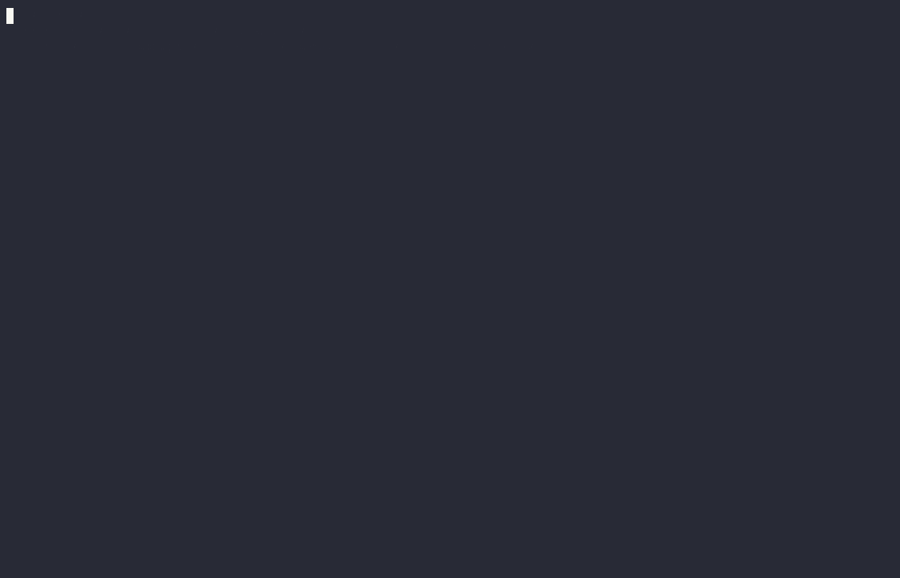

# JNILog — Android JNI Call Interception & Structured Logging

A native shared library that hooks the **entire JNI function table** (~228 function pointers) inside any Android process, logs every call with **type-directed ANSI coloring**, and supports **runtime JSON configuration** for whitelist/blacklist/regex-based filtering.

Inspired by [frida-jnitrace](https://github.com/iddoeldor/frida-jnitrace).  No Frida required — the library injects itself via PLT/GOT patching in zygote and operates as a standalone `.so`.

---

## Quick Start

Requires the Android NDK (set `ANDROID_NDK_HOME` or `ANDROID_NDK`) and Go ≥ 1.26.

```bash
# Build the payload (produces dist/libjnilog.so)
xmake b jnilog

# Push to a connected device
xmake push                                 # convenience: adb push dist/libjnilog.so /data/local/tmp/

# Filter with a config file (optional)
echo '{"categories":["methods","fields","lookups"],"array_items":16}' \
  | adb shell tee /data/local/tmp/jnilog.json
```

**Inject and stream a live trace** with the companion loader,
[`gozinject`](https://github.com/Arsylk/gozinject) — a root, ptrace-free zygote
injector that `dlopen`s the payload into a fresh app process and hides its VMAs
from the target:

```bash
cd ../gozinject
xmake run --lib=/path/to/libjnilog.so --pkg=com.example.app \
          --debug --logcat --logtag=JNILogPayload
```

That single command resolves the target's main activity, stages the payload,
`am start`s the app, injects, and then tails the rendered JNI trace (logcat tag
`JNILogPayload`) straight to your terminal. Any other injection vector works too
(see [Loading the payload](#loading-the-payload-into-a-target-process)); the
library self-installs the JNI-table hooks from `library_constructor` as soon as a
`JavaVM` is available.

### Live demo



The recording above (also as an
[asciinema](https://asciinema.org) cast,
[`docs/media/jnilog-jiagu-sumiao.cast`](docs/media/jnilog-jiagu-sumiao.cast)) runs the
inject command against a **360-Jiagu (`libjiagu_64.so`) packed app**. You can watch the
commercial packer's `com.stub.StubApp` native stub bootstrap itself through JNI —
`dlopen` of `libjiagu_64.so` out of the app's private `.jiagu/` dir, then
`getAppContext` → `ActivityThread.currentActivityThread` → `currentPackageName` →
`Build.VERSION.SDK_INT` → `checkPermission(READ_PHONE_STATE)` — every call symbolized to
`libjiagu_64.so!0xNNNN`, all before the first activity is drawn. Play the cast locally
with `asciinema play docs/media/jnilog-jiagu-sumiao.cast`.

---

## Architecture

```
┌──────────────────────────────────────────────────────────────┐
│  main.c          Injection layer                             │
│                  • ELF PLT/GOT patching (__loader_dlopen)    │
│                  • mprotect interception (live map tracking) │
│                  • VM table hook (GetEnv → new threads)      │
├──────────────────────────────────────────────────────────────┤
│  hooks.c         Core hook table + ~90 utility hooks         │
│  hook_methods.c  All Call*Method variants via X-macros       │
│  hook_fields.c   All Get/Set*Field variants via X-macros     │
│  hook_internal.h Types, enums, 3 X-macro type lists          │
├──────────────────────────────────────────────────────────────┤
│  hook_logging.c  Typed wire-protocol encoding                │
│  hook_common.c   Method/field caches, reentrancy, config     │
├──────────────────────────────────────────────────────────────┤
│  visualize.c     JNI object introspection (class name,       │
│                  toString, array elements, type detection)   │
│                  + vis_encode_typed_args (method arg → wire) │
├──────────────────────────────────────────────────────────────┤
│  bridge.c        ART symbol resolution, Go↔C glue            │
│  rangeset.c      /proc/self/maps caller filtering            │
├──────────────────────────────────────────────────────────────┤
│  Go side                                                    │
│  logger.go       Colorized formatter, all emit_* functions   │
│  value.go        JNIValue, decodeArgs, buildReturnValue      │
│  config.go       JSON config, cgo exports, call-key builder  │
│  event_pipe.go   AF_UNIX socket reader, call_id pairing      │
│  main.go         event-pipe bootstrap, logcat sink, bridge   │
└──────────────────────────────────────────────────────────────┘
```

### Freestanding C-bridge (no libc)

The entire C bridge is built **without any reroute­able libc calls** — str/mem, `vsnprintf`,
heap, locks, I/O, and `dladdr` are reimplemented in-tree (`src/cbridge/freestanding/`) on raw
`svc` syscalls, a futex, an mmap allocator, and a `/proc/self/maps` symbolizer. The bridge
issues zero `strlen`/`malloc`/`send`/… through its own GOT, so a co-injected GOT/PLT-patching
libc logger (or a packer's libc hooks) cannot observe the payload's internals. A readelf
import gate in the build enforces this. (The Go runtime keeps its own cold libc imports.)

### Data flow

1. **Hook entry** → checks `should_log_from_caller` (is caller from a tracked library?)  
2. **Config gate** → checks whitelist/blacklist (cached O(1) lookup, cgo crossing only once per function name)  
3. **Arg extraction** → `extract_va_args` pulls typed args from `va_list`  
4. **Wire encoding** → `vis_encode_typed_args` produces `sigChar\x01value\x02` records (control bytes in string content are escaped)  
5. **Event emit** → `log_jni_call` packs the record + a monotonic `call_id` and `send()`s it over an AF_UNIX `SOCK_DGRAM` socket — **no cgo on the hot path**; the `call_id` is pushed on a per-thread stack so nested calls pair correctly  
6. **Call execution** → original JNI function runs  
7. **Return encoding** → `log_method_return_value` resolves the typed return value and emits a return record carrying the popped `call_id`  
8. **Go reader** → a goroutine drains the socket, builds a `callFrame` into `pendingCalls` keyed by `call_id` on the CALL record, and on the matching RETURN record pairs them (`LoadAndDelete`) → `emitCallFull` checks Gate 3 (regex blacklist), formats and writes  

---

## Wire protocol (`event_pipe`)

Per-JNI-event cgo crossings into the Go runtime trip integrity VMs on anti-tamper
apps (the cgo dispatch fires Go-scheduler activity that is detectable across thread
boundaries). So the hot path is **libc-only**: each hook serializes its arguments
into one packed little-endian datagram and `send()`s it over an `AF_UNIX
SOCK_DGRAM` socketpair; a Go reader goroutine drains the other end. Output is
byte-identical to the old cgo-callback design — only the transport changed.

```
 offset  size  field
 ────────────────────
   0      4    magic = 'JNIE' (0x4A4E4945)
   4      1    event type (EV_CALL=1, EV_RETURN=2, EV_LOOKUP=3,
                            EV_OBJ_RETURN=4, EV_FIELD_ACCESS=5, EV_REGISTER_NATIVES=6)
   5      1    receiver_kind   (CALL only)
   6      1    ret_kind        (RETURN only)
   7      1    nstrings        (string slots that follow)
   8      4    offset (int32, caller PC − library base)
  12      4    reserved
  16      8    call_id         (monotonic; pairs CALL ↔ RETURN)
  24      8    mid_or_raw      (mid for CALL · ret_raw for RETURN · clazz for LOOKUP)
  32      …    strings[i] = u16-le length + raw bytes (no NUL)
```

String slots per event:

| Event | Strings |
|---|---|
| `EV_CALL` | `jni_name, receiver_str, receiver_extra, class_name, method_name, encoded_args, caller` |
| `EV_RETURN` | `name, ret_str, ret_extra` |
| `EV_LOOKUP` | `lookup_type, name, sig, class_name, caller` |
| `EV_FIELD_ACCESS` | `name, receiver_str, receiver_extra, field_name, value_str, value_extra, caller` |
| `EV_REGISTER_NATIVES` | `class_name, methods, caller` (clazz in `mid_or_raw`) |

**Bounded, desync-proof framing.** Datagrams are capped (`EVENT_PIPE_MAX_BYTES =
8192`); long strings are truncated on safe boundaries so a giant `toString()` can't
desync the stream. Content bytes that collide with framing markers
(`\x01`–`\x05`, `\x1A`) are escaped as a 2-byte `(\x05, b^0x40)` pair, and a
truncation that lands mid-escape or mid-UTF-8 retreats to a clean boundary. When
the writer socket is full (consumer behind), events are **dropped, never blocked**;
`event_pipe_drops()` exposes a monotonic drop count for observability.

**Deferred render & global-ref ownership.** Resolving a `jclass`/`jobject` to a
name or `toString()` needs a JNIEnv, which the hook must not use on the app's
thread. Instead the hook `NewGlobalRef`s the object (only when a consumer is
attached and draining — `event_pipe_consumer_ready()`), records it in a per-thread
sidecar, and writes a `\x1A<slot>` placeholder into the string. The Go reader —
attached as a daemon thread with its own JNIEnv — substitutes each placeholder by
rendering the ref off-thread, then `DeleteGlobalRef`s it. Ownership transfers to the
consumer **iff the datagram is delivered**; on overflow/failure the hook frees the
refs itself, so a dropped event never leaks a global ref.

---

## Hook Coverage — Complete JNINativeInterface

| Category | Count | Key functions |
|---|---|---|
| **Method calls** | 93 | `Call*Method`, `CallStatic*Method`, `CallNonvirtual*Method`, `NewObject` — all 9 types × 3 variants |
| **Field access** | 36 | `Get/Set*Field`, `Get/SetStatic*Field` — all 9 types |
| **Lookups** | 5 | `FindClass`, `GetMethodID`, `GetStaticMethodID`, `GetFieldID`, `GetStaticFieldID` |
| **Register** | 2 | `RegisterNatives`, `UnregisterNatives` |
| **References** | 9 | `New/Delete{Global,Local,WeakGlobal}Ref`, `IsSameObject`, `Push/PopLocalFrame` |
| **Strings** | 12 | `{New,Get,Release}{String,StringUTF}{Chars,}`, `GetString{UTF,}{Length,Region}` |
| **Arrays — primitive** | 40 | `New*Array`, `Get/Release*ArrayElements`, `Get/Set*ArrayRegion` — all 8 types |
| **Arrays — object** | 4 | `NewObjectArray`, `Get/SetObjectArrayElement`, `GetArrayLength` |
| **Critical sections** | 4 | `Get/ReleasePrimitiveArrayCritical`, `Get/ReleaseStringCritical` |
| **Exceptions** | 7 | `Throw`, `ThrowNew`, `Exception{Occurred,Describe,Clear,Check}`, `FatalError` |
| **Class/Object** | 7 | `AllocObject`, `IsInstanceOf`, `DefineClass`, `GetSuperclass`, `IsAssignableFrom`, `GetObjectClass` |
| **Direct buffers** | 3 | `NewDirectByteBuffer`, `GetDirectBuffer{Address,Capacity}` |
| **Monitors** | 2 | `MonitorEnter`, `MonitorExit` |
| **Misc** | 6 | `GetVersion`, `GetJavaVM`, `ToReflected{Method,Field}`, `FromReflected{Method,Field}` |
| **Total** | **228** | |

---

## Output Format

Every JNI event is rendered as a single colored log line.  Colors follow a consistent palette:

| Element | Color | Example |
|---|---|---|
| Class name | Cyan | `com.miniclip.framework.ThreadingContext` |
| Method name | Green | `queueEvent` |
| Field name | Magenta | `Main` |
| String content | Yellow | `"en-US"` |
| Numeric literals | Magenta | `42`, `0x2a`, `3.14f` |
| Boolean literals | Magenta | `true`, `false` |
| Null | Magenta | `null` |
| Method/field ID | Maroon | `0x4346` |
| Caller address | Lavender/Pink/Orange | `libfoo.so!0x1234` |
| Separators | Blue/Gray | `→`, `.`, `: `, `::` |

### Method calls

```
[CallStaticVoidMethodV]  com.x.Miniclip::queueEvent(com.x.ThreadingContext("Main"), com.x.NativeRunnable@f653cdb) @ libfoo.so!0x3d992e4
```

Instance methods show `this=`:
```
[CallObjectMethodV] this=java.util.HashMap$EntrySet@5cac94d java.util.Set::iterator() → java.util.HashMap$EntryIterator @ libfoo.so!0x3d98d5c
```

### Field access

Static fields — no `this=`, class name from receiver:
```
[GetStaticObjectField] com.x.ThreadingContext.Main: com.x.ThreadingContext → com.x.ThreadingContext("Main") @ libfoo.so!0x3d9c23c
```

Instance fields:
```
[GetObjectField] this=ApplicationInfo{5f6d975 io.smscash} nativeLibraryDir: java.lang.String → "/data/app/.../lib/arm64" @ libfoo.so!0x66920
```

### Lookups

```
[FindClass] "android/content/pm/ApplicationInfo" → android.content.pm.ApplicationInfo @ libfoo.so!0x668e4
[GetFieldID] android.content.pm.ApplicationInfo.nativeLibraryDir: java.lang.String → 0x7406efa025 @ libfoo.so!0x66908
[GetStaticMethodID] android.util.Log::d(String, String): int → 0x7406efa021 @ libfoo.so!0x1d3c8
```

### Exception events

```
[ExceptionCheck] () → false @ libfoo.so!0x3d9c318
[ExceptionOccurred] () → java.lang.NullPointerException: Attempt to invoke virtual method... @ libfoo.so!0x112868
```

### Array operations

```
[NewByteArray] (8) → [0x00, 0x00, 0x00, 0x00, 0x00, 0x00, 0x00, 0x00] @ libfoo.so!0x3d9b554
[GetArrayLength] ([0xde, 0x02, 0x64, 0x26, 0xfe, 0x7e, 0x01, 0x63, 0xed, 0xbc, 0xe0, 0x3a, 0x15, 0x39, 0xec, 0xec]) → 16 @ libfoo.so!0x3d9b5fc
[SetObjectArrayElement] (array=[com.x.weeklypremium, null +2 more], index=8, value=null) @ libfoo.so!0x3d9af68
```

### Void-returning calls

`→ void` is suppressed — the side effect is the point:
```
[DeleteLocalRef] (com.x.ThreadingContext("Main")) @ libfoo.so!0x3d988dc
[ReleaseByteArrayElements] (2, "free") @ libfoo.so!0x1234
```

---

## Configuration

Place a JSON file at `/data/local/tmp/jnilog.json` (or set `JNILOG_CONFIG` env var to a custom path).  Without a config file, **everything is logged** — identical to pre-config behavior.

### Schema

```json
{
  "functions":   [],       // Whitelist: exact JNI function names. Empty = all.
  "categories":  [],       // Category expansion merged into whitelist.
  "exclude": {
    "functions":  [],      // Blacklist: exact JNI function names to suppress.
    "categories": [],      // Blacklist category expansion.
    "regex":      []       // Regex patterns matched against call-key strings.
  },
  "array_items": 16,       // Max array elements before "+N more" truncation.
  "class_name_only": false // true → never call app toString(); render objects by
                           // class name only. Opt-in safety valve for anti-analysis
                           // targets where even a guarded toString() is unwanted.
}
```

### Available categories

| Category | Member count | What it includes |
|---|---|---|
| `methods` | 93 | All `Call*Method`, `CallStatic*Method`, `CallNonvirtual*Method`, `NewObject` |
| `fields` | 36 | All `Get/Set*Field`, `Get/SetStatic*Field` |
| `exceptions` | 7 | `Throw`, `ThrowNew`, `Exception*`, `FatalError` |
| `arrays` | 44 | All `New*Array`, `Get/Set/Release*Array*`, `GetArrayLength`, `SetObjectArrayElement` |
| `strings` | 12 | All `*String*` operations |
| `refs` | 10 | All `*GlobalRef`, `*LocalRef`, `IsSameObject`, `Push/PopLocalFrame`, `EnsureLocalCapacity` |
| `lookups` | 5 | `FindClass`, `GetMethodID`, `GetStaticMethodID`, `GetFieldID`, `GetStaticFieldID` |

### Interactive configurator (`tools/jnilogcfg`)

A standalone Go TUI/CLI builds and deploys this config without hand-editing JSON — toggle
categories (off / include / exclude), fuzzy-pick individual functions with autocomplete, set
`array_items`, with a live JSON preview:

```sh
xmake cfgtui                              # interactive TUI on docs/jnilog.json
xmake cfgbuild                            # build the host binary into dist/jnilogcfg
dist/jnilogcfg -f docs/jnilog.json -push  # non-interactive: save + adb push to the device
```

In the TUI, `p`/`P` push/pull the config to/from `/data/local/tmp/jnilog.json` on the device.
It mirrors the schema above exactly. See `tools/jnilogcfg/README.md`.

### Three-tier gate system

```
JNI call enters hook
        │
        ▼
  Gate 1:  is function name in exclude.functions/categories?
  (C side, O(1) map lookup via cached result)
        │
  Yes ───┴──→  skip (cheapest bail)
        │
  No
        │
        ▼
  Gate 2:  is function name in functions/categories?
  (C side, O(1) map lookup; nil set = everything passes)
        │
  No ───┴──→  skip
        │
  Yes
        │
        ▼
  (Build wire format, execute original JNI, push to Go)
        │
        ▼
  Gate 3:  does the call-key match any exclude.regex pattern?
  (Go side, compiled regex match)
        │
  Yes ───┴──→  suppress line
        │
  No
        │
        ▼
  Write formatted log line
```

### Example configs

**Suppress noise categories:**
```json
{
  "exclude": {
    "categories": ["refs", "strings"]
  }
}
```

**Focus on methods and fields only:**
```json
{
  "categories": ["methods", "fields", "lookups"]
}
```

**Ignore all `iterator()` calls:**
```json
{
  "exclude": {
    "regex": ["::iterator\\("]
  }
}
```

**Everything except one package:**
```json
{
  "categories": ["methods", "fields", "lookups", "exceptions"],
  "exclude": {
    "regex": ["^(?!.*\\|?com\\.myapp\\.).*$"]
  }
}
```

**Deep array inspection:**
```json
{
  "array_items": 64
}
```

### Call-key format for regex filtering

`exclude.regex` patterns are matched against plain-text keys (no colors, no truncation).  Keys use `|` to separate the JNI function name from context:

| Event | Key format |
|---|---|
| Instance method | `CallObjectMethod\|com.x.Foo::bar(int, java.lang.String): void` |
| Static method | `CallStaticVoidMethod\|com.x.Bar::baz(): java.lang.String` |
| Field get (static) | `GetStaticObjectField\|com.x.Singleton.instance: com.x.Singleton` |
| Field set (instance) | `SetIntField\|com.x.Counter.count: int` |
| FindClass | `FindClass\|android.content.pm.ApplicationInfo` |
| GetMethodID | `GetMethodID\|java.util.Set::iterator(): java.util.Iterator` |
| RegisterNatives | `RegisterNatives\|com.x.nativeJNI.CocoJNI` |
| NewObject | `NewObject\|com.x.Runnable::<init>(long): void` |
| Utility hooks | `DeleteLocalRef`, `NewByteArray`, `ReleaseBooleanArrayElements` |

**Regex examples:**

| Goal | Pattern |
|---|---|
| One function | `^CallObjectMethod\|` |
| Function family | `^Release.*ArrayElements$` |
| Everything on a class | `\|com\.miniclip\.` |
| A specific method | `::iterator\(` |
| All static field sets | `^SetStatic.*Field\|` |
| Null exception checks | `\|\(none\)$` |

---

## Building

**Requirements:**
- Android NDK (for `aarch64-linux-android21-clang`) — set `ANDROID_NDK_HOME` or `ANDROID_NDK`
- Go ≥ 1.26 with `CGO_ENABLED=1` (set automatically by the xmake target)
- xmake (build orchestration)

```bash
# Build the payload library
xmake b jnilog
# → dist/libjnilog.so (ARM64)

# Push to a connected device
xmake push
```

The payload is a **cgo shared library** — `go build -buildmode=c-shared` produces a
single `.so` containing the Go runtime plus the C hook layer, linking
`encoding/json`, `regexp`, and the Go runtime statically.

---

## Loading the payload into a target process

The payload is a plain `.so`; anything that gets it mapped into the target with a
live `JavaVM` will work. The companion loader is the path of least resistance:

- **[`gozinject`](https://github.com/Arsylk/gozinject) (recommended)** — a root,
  `ptrace`-free, fork-time zygote injector. One command builds, stages, launches,
  injects, and (optionally) tails the trace:
  ```bash
  xmake run --lib=dist/libjnilog.so --pkg=com.example.app --debug --logcat --logtag=JNILogPayload
  ```

### How gozinject loads the payload

Rather than attach to a running process, gozinject catches the target *at fork
time*, in the narrow window after `fork()` but before the app's anti-tamper arms:

1. **Trap `setArgV0`.** It byte-patches
   `android_os_Process_setArgV0` in `/system/lib64/libandroid_runtime.so` — the
   framework calls this exactly once per forked app, to rename the process from
   `<pre-initialized>` to its package name. A 428-byte stub filters by `getpid()`
   (zygote) + `getuid()` (target app UID), so unrelated forks fall straight through
   to the real `setArgV0`.
2. **Stub → stage → `dlopen`.** The matched child `mmap`s a 256 KB RWX region,
   reads in a 4 KB stage, and the stage `dlopen`s the payload from a per-app temp
   file in `/data/data/<pkg>/`. The injector restores the original `setArgV0` bytes
   the moment the child is spotted, so the trap is live for a single fork.
3. **Conceal.** Once loaded, the injector **`UnlinkSoinfo`** (removes the payload
   from the linker's `soinfo` list) and **hides the payload's VMAs** (file
   segments, guards, `.bss`, and the stage region) so the mapping is invisible in
   the child's `/proc/self/maps`. No `ptrace`, no debugger attach, no persistent
   on-disk artifact.

### The `vma_hide` kernel module

The VMA-hiding step (3) is what makes the injection invisible to a same-process
anti-tamper scan of `/proc/self/maps`, and it is **not** pure userspace — it
depends on a **custom kernel module** that exposes `/proc/vma_hide` with a per-UID
hide list:

```
add   <uid> 0x<start> 0x<end>     # hide [start,end) from this UID's /proc/self/maps
clear <uid>                       # drop this UID's hide list
clear                             # drop all hide lists
```

gozinject writes `add <uid> …` for each payload segment after `dlopen`, and
`clear <uid>` at the start of every run. Without this module the injection still
*works*, but the payload's mappings remain visible — i.e. you lose the maps-level
stealth layer, not the tracing. Validated on **Android 16 (API 36), arm64, kernel
4.19** with the module present, against a jiagu-packed app (end-to-end the child
shows no injection artifact in `/proc/self/maps`). Requirements: a rooted device
(Magisk / KernelSU / APatch — `su -c` must work), the `vma_hide` kernel module, and
SELinux permissive **or** a policy that lets root write `/proc/vma_hide`. See the
[gozinject README](https://github.com/Arsylk/gozinject) for the module's full ABI
and build.

Other vectors, if gozinject doesn't fit your environment:

- **`LD_PRELOAD`** — works for a fresh fork of an executable you control. The
  payload constructor detects this case via the `LD_PRELOAD` env var and
  initializes synchronously instead of using a background thread.
- **Zygote-time injection** — patch `__loader_dlopen` in zygote's `libdl.so` GOT
  so every spawned app inherits the loader hook. The shipped payload includes
  this self-installing logic in `library_constructor`, but it requires that the
  payload itself already be loaded into zygote (separate boot-time tool).
- **Process-attached injection** — `ptrace`-based injectors (e.g. parasite-style
  shellcode) that force-load the payload into a running PID.
- **Zygisk module** — wrap the payload as a Zygisk module so Magisk handles the
  zygote injection lifecycle.

On load, the constructor runs through `init_once_handler` (`main.c`):
1. Resolve `JNI_GetCreatedJavaVMs` / `JNI_OnLoad` in `libart.so`.
2. Run `bridge_init` (Go bridge + ART symbol resolution).
3. Patch `__loader_dlopen` / `__loader_android_dlopen_ext` in `libdl.so`.
4. If a `JavaVM` already exists, install the JNI-table hooks immediately;
   otherwise wait for `JNI_OnLoad` / `GetEnv` to provide one.

Per-process config is read from `/data/local/tmp/jnilog.json` (or
`JNILOG_CONFIG=<path>`); see [`docs/CONFIG_SCHEMA.json`](docs/CONFIG_SCHEMA.json).

---

## Device bring-up & recording notes

Real gotchas seen bringing this up on a rooted Android 16 (APatch) device:

- **No trace appears — wrong logcat tag.** The payload logs under the fixed tag
  `JNILogPayload` (`bridge.h`). `gozinject --logtag` is a *logcat filter*, so it
  must be `--logtag=JNILogPayload`; anything else filters your own output away.
- **`adb push` to `/data/local/tmp` fails with "couldn't create file: Permission
  denied".** On some Magisk/APatch setups `/data/local/tmp` is labeled
  `shelltools_file`, and the `adbd` sync domain can't *create* files there — but it
  *can* overwrite an existing file labeled `shell_data_file`. Pre-stage once:
  ```bash
  adb shell 'touch /data/local/tmp/foo'
  adb shell su -c 'chcon u:object_r:shell_data_file:s0 /data/local/tmp/foo'
  adb push local-foo /data/local/tmp/foo      # now an overwrite → succeeds
  ```
- **Recording the session hangs at "Deploying…".** Under a headless PTY (e.g.
  `asciinema` with no controlling terminal) the loader's colored logger emits an
  OSC background-color / cursor-position query and blocks on the reply that never
  comes. Run with `TERM=dumb` — color is force-set regardless, so output stays
  colored. (The recordings in `docs/media/` were captured this way via `script`.)
- **The target app dies ~2 s after launch.** Hardened apps (e.g. pairip-protected)
  detect the rooted/tampered environment and self-terminate; that is the app's
  anti-tamper, independent of jnilog. The trace up to that point is valid. For
  long-running stability tests, pick a target that stays alive.

---

## Project Structure

```
jnilog/
├── src/
│   ├── cbridge/                   # C layer (hooks, injection, visualization)
│   │   ├── main.c                 # Constructor, PLT/GOT patching, VM hooks
│   │   ├── bridge.c/.h            # ART symbol resolution, Go↔C funnel functions
│   │   ├── hooks.c                # JNI table slot assignments + utility hooks
│   │   ├── hook_methods.c         # Call*Method variants (X-macro generated)
│   │   ├── hook_fields.c          # Get/Set*Field variants (X-macro generated)
│   │   ├── hook_logging.c         # Method/field log contexts, wire encoding dispatch
│   │   ├── hook_common.c          # Caches, reentrancy guards, config query cache
│   │   ├── hook_internal.h        # Shared types, enums, X-macro type lists
│   │   ├── visualize.c/.h         # JNI object introspection + typed-arg wire encoding
│   │   └── rangeset.c             # dl_iterate_phdr-based caller-range filter
│   └── go/                        # Go layer (rendering, config, types)
│       ├── main.go                # event-pipe bootstrap, logcat sink, bridge init
│       ├── init.go                # Process init, package-name resolution
│       ├── event_pipe.go          # AF_UNIX socket reader, call_id pairing, drop monitor
│       ├── logger.go              # Colorized formatter, all emit_* functions
│       ├── value.go               # JNIValue type system, decodeArgs, buildReturnValue
│       ├── config.go              # JSON config parsing, cgo exports, call-key builder
│       ├── gate_shared.go         # shared gate impl (cgo export + host test)
│       ├── signature.go           # JNI signature parser
│       ├── rangeset.go            # Thin Go wrappers for C rangeset
│       ├── visualize.go           # Thin Go wrappers for C visualize functions
│       ├── cbridge_all.c          # cgo aggregator that compiles src/cbridge/*.c
│       ├── ndk_compat.h           # GCC-only shim so host gopls can parse NDK headers
│       └── types_host.go          # !android mirror of formatter/decoder for host tests
├── docs/
│   └── CONFIG_SCHEMA.json         # JSON Schema for config file
├── xmake.lua                      # Build orchestration
└── README.md
```

---

## Key Design Decisions

### C ↔ Go separation via typed wire protocol
The C hook layer captures raw JNI data and encodes it into a byte-delimited wire format.  Go receives fully-typed **JNIValue** structs with no string parsing — the wire protocol is the single contract between C and Go:

```
C:  sigChar \x01 value [ \x03 extra ] \x02
Go: decodeArgs() → []JNIValue{Kind, Int, Float, Str, Extra, Items}
```

All colorization, formatting, and output logic lives exclusively in Go.

### X-macro code generation
Three X-macro type lists (`JNI_PRIMITIVE_ARRAY_TYPES`, `JNI_FIELD_TYPES`, `JNI_INSTANCE_NONVOID_TYPES`) generate ~200 hook functions from single definitions.  Adding support for a new JNI primitive type requires changing exactly one macro.

### Reentrancy via TLS flag
Hooks call JNI to resolve object types for display (e.g. `toString()` on return values).  Without protection, these JNI calls would re-enter our own hooks → infinite recursion.  A thread-local `g_in_hook` flag short-circuits reentrant calls directly to the original JNI table.

### call_id pairing across the event socket
Each `log_jni_call` stamps the event with a monotonic `call_id` and pushes it on a **per-thread LIFO call-id stack** (in `bridge.c`); the matching `log_jni_return` pops it, so a nested hooked call (e.g. an app method that itself calls hooked JNI between a call and its return) cannot clobber the outer frame's id.  The id rides the wire record; the Go reader stores the CALL in a `pendingCalls` map keyed by `call_id` and pairs the RETURN to it (`LoadAndDelete`).  Orphaned calls (a RETURN dropped under load) are evicted as call-without-return so the map stays bounded.

### Multi-sink logging
Lines are written to both `logcat` (`ANDROID_LOG_INFO`) and `stdout`.  `NO_COLOR=1` environment variable disables ANSI escapes for plain-text output.

### Fork-safe initialization
The library constructor must initialize in every forked child process.  A mutex-guarded `g_initialized` flag (process-local data, resets to 0 after fork) replaces `pthread_once` which survives fork and would skip init in children.

---

## Troubleshooting

**Injection times out ("timeout identifying child process"):**  
The most common cause is a previous injection that left zygote in a bad state.  Reboot the device.  The `pthread_once` → mutex-guarded flag fix prevents this from recurring.

**No JNI logs appear:**  
Check that the app actually loads native libraries and makes JNI calls.  Some apps are pure Java/Kotlin and never touch JNI.  The config file may be blacklisting everything — verify with an empty `{}` config.

**App crashes on injection:**  
Some apps (especially games with anti-tamper like AppSealing, Jiagu, DexProtector) will detect the injected library and kill the process.  This is expected behavior for protected apps.

**"Failed to resolve art::ArtField::GetName" warning:**  
The library tries three mangled symbol names for `art::ArtField::GetName` across ART versions.  If none resolve, field names fall back to the method/field ID cache (populated when `GetFieldID`/`GetStaticFieldID` hooks fire).  Unresolved fields show `<unresolved>` in red.

**Build fails with "conflicting types for config_function_*":**  
You have a stale `_cgo_export.h` or `bridge.h` declaring cgo exports.  Delete the build directory and rebuild from scratch: `rm -rf .xmake build dist && xmake b jnilog`.

---

## License

MIT
